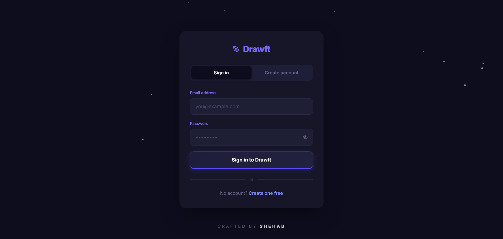
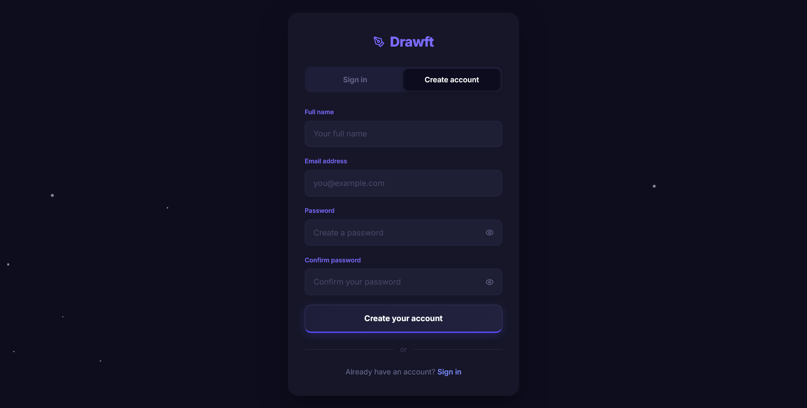
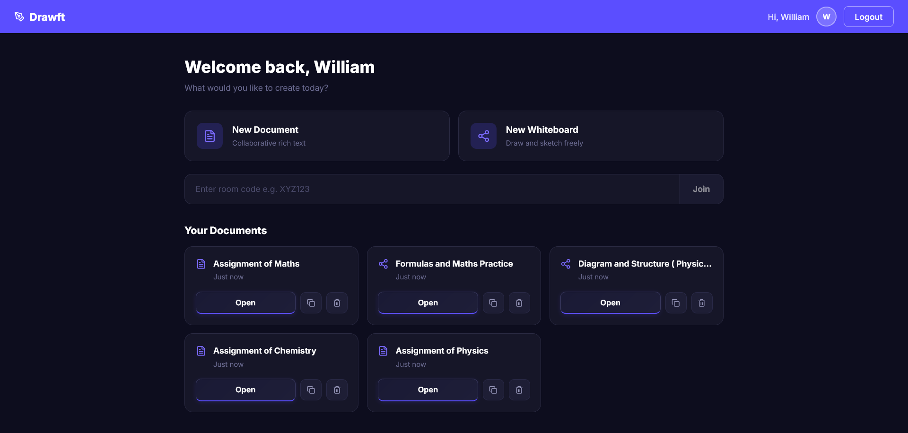
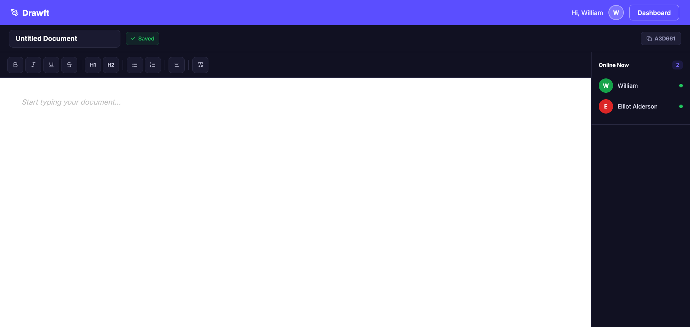
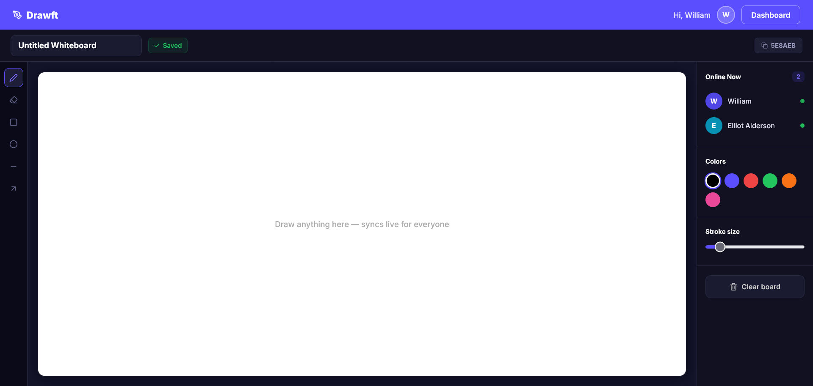

# Drawft — Real-Time Collaboration Tool

**Live Demo:** [Link to Live Application](#)

## Internship Details

| | |
|---|---|
| **Company** | CODTECH IT SOLUTIONS |
| **Name** | SHEHAB MOHAMMAD SADIQUE |
| **Intern ID** | CTIS8896 |
| **Domain** | MERN STACK WEB DEVELOPMENT |
| **Duration** | 6 WEEKS |
| **Mentor** | NEELA SANTHOSH |
| **Task** | Task 3 — Real-Time Collaboration Tool |

## 📝 Project Description

Drawft is a highly sophisticated, AAA-quality real-time collaboration platform architected on the MERN stack (MongoDB, Express, React, Node.js) and powered by WebSockets via Socket.io. Designed to bridge the gap between remote teams and individuals, Drawft delivers a seamless, zero-latency environment where users can co-create, brainstorm, and edit content together as if they were in the same room.

The application boasts a meticulously crafted, premium dark-themed UI enhanced with modern glassmorphism aesthetics. Beyond its visual appeal, Drawft is engineered for robust performance and security. It implements a secure JWT-based authentication system, dynamic real-time presence tracking to instantly show who is online, and advanced client-side security measures that actively thwart code inspection, console access, and unauthorized data manipulation.

**Key Features Include:**
- **Real-Time Synchronization:** Experience true zero-latency collaboration. Every keystroke in the document editor and every brushstroke on the whiteboard is instantly broadcasted and mirrored across all connected clients.
- **Secure Authentication System:** A resilient user authentication flow leveraging JSON Web Tokens (JWT), complete with secure password hashing, strict form validation, and session management.
- **Rich-Text Document Editor:** A fully-featured, collaborative text editor equipped with comprehensive formatting tools. Users can collaboratively draft, format, and structure documents in real-time.
- **Interactive Collaborative Whiteboard:** A dynamic, infinite-canvas whiteboard offering freehand drawing, shape tools, color palettes, and real-time stroke rendering for visual brainstorming.
- **Live Presence & Room Management:** Users can instantly generate unique shareable room codes. The application features real-time "Online Now" indicators, dynamically updating the active user list as participants join or leave.
- **Advanced Anti-Inspection Security:** Robust client-side protections that aggressively block Developer Tools, context menus, and keyboard shortcuts (like F12, Ctrl+Shift+I) to secure the application interface and underlying logic.

This project was developed as **Task 3** for the CODTECH IT SOLUTIONS internship program, serving as a comprehensive demonstration of advanced full-stack development capabilities, complex state management, WebSocket integration, and premium UI/UX design execution.

## 📸 Screenshots

### 1. Authentication (Login & Register)
A high-performance, glassmorphism authentication interface with dynamic 3D floating background particles and robust form validation.

  
  

### 2. Main User Dashboard
The central hub for users to create new documents, generate shareable room codes, or instantly join existing collaborative sessions.

### 3. Real-Time Document Editor
A live, synchronized rich-text editor where multiple users can draft, format, and edit documents simultaneously with instant updates.

### 4. Collaborative Whiteboard
A shared, interactive canvas allowing teams to draw, design, and brainstorm in real-time with zero latency.

## 🚀 Tech Stack

- **Frontend:** React (Vite), Vanilla CSS, React-Quill, HTML5 Canvas, Socket.io-client
- **Backend:** Node.js, Express.js, Socket.io (WebSockets), JSON Web Tokens (JWT)
- **Database:** MongoDB (Mongoose)

---

  <b>Crafted by SHEHAB</b> 
  © 2026 Shehab Sadique. All Rights Reserved.

